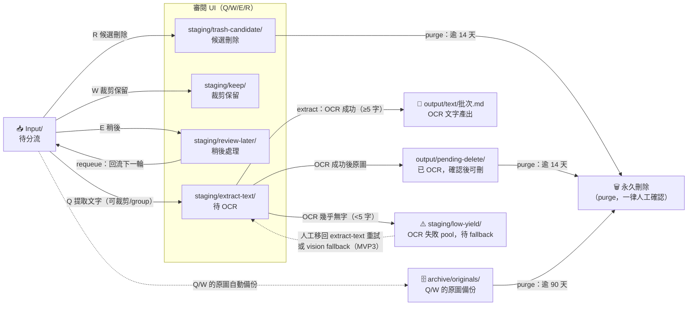
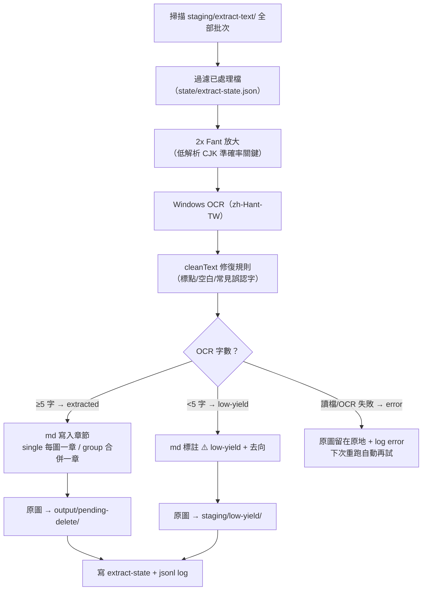

# 截圖快速整理工具

本工具是本地端截圖審閱與分流 app。把圖片放進 `Input/` 後，啟動工具即可用大圖預覽、快捷鍵、裁剪模式快速分類。

## 啟動

可直接雙擊：

```text
Start_Tool.bat
```

或在此資料夾執行：

```powershell
npm start
```

開啟終端機顯示的網址，預設為：

```text
http://localhost:3030
```

連接埠可用環境變數 `PORT` 覆寫。

### 自訂 batch 名稱

預設 batch 為今日日期（`YYYY-MM-DD`，Asia/Taipei）。要用自訂名稱（會反映在輸出路徑與 log 檔名）時：

```powershell
node server.mjs --batch my-batch-name
```

- 名稱會自動 sanitize 成安全檔名字元（非法字元換成 `_`）。
- 指定 `--batch` 時不觸發換日重置，適合跨日整理同一批。
- ⚠️ PowerShell 會把 `npm start -- --batch X` 的 `--` 剝掉，導致參數遺失；請直接用 `node server.mjs --batch X`。

## 運作全貌（Operation Flow）

### 檔案生命週期 — 每張圖從進入到離開的所有路徑



- `keep/` 是終點站（成品自取）；`low-yield/` **永不被 purge**，直到你處理它。
- 每一條實線移動都寫入 `logs/<批次>.jsonl`，可完整回溯。

### OCR 管線內部 — `extract` 對每張圖做的事



- 順序刻意為「先寫 md → 再搬檔 → 再存 state」：中途崩潰寧可重複、不會遺失。
- 重跑冪等：已處理的檔案自動跳過；把 low-yield 圖**手動移回** `staging/extract-text/<批次>/` 即可重試 OCR。

### 核心機制一覽

| 機制 | 運作方式 |
|---|---|
| Session 續傳 | 進度存 `state/current-session.json`（tmp+rename 原子寫入），關掉重開接著整理 |
| 批次 | 預設今日日期（Asia/Taipei）；`--batch` 自訂名稱且不觸發換日重置 |
| Undo | `Z` 還原最近 10 步（Q/W/E/R 皆可）：刪除輸出檔、原圖移回 `Input/` |
| Group | `G` 開始/結束；期間 Q 的裁剪集中到 `group-###/`，OCR 時合併成一章；`Shift+G` 整組取消復原 |
| 撞名保護 | 目的地同名自動加 `__2`、`__3` 後綴，永不覆寫既有檔案 |
| 併發序列化 | 分類、undo、維護任務全走同一佇列，多分頁/同時操作不會競態 |
| 審計 log | 每筆檔案異動 append 到 `logs/<批次>.jsonl`（分類/undo/OCR/回流/purge） |
| 刪除安全 | requeue/purge 預設 dry-run；真刪永遠要人按最後一下；工具本身永不自動刪檔 |

## 快捷鍵

| 按鍵 | 行為 |
|---|---|
| Q | 進入裁剪模式，輸出到 `staging/extract-text/YYYY-MM-DD/single/` 或 `group-###/` |
| W | 進入裁剪圖片模式，輸出到 `staging/keep/YYYY-MM-DD/` |
| E | 移到 `staging/review-later/YYYY-MM-DD/`，本輪不再 loop |
| R | 移到 `staging/trash-candidate/YYYY-MM-DD/` |
| Z | Undo 最近 10 次操作 |
| P | 暫停並顯示本批次統計 |
| S | 查看本批次統計（唯讀、不暫停），再按 S 或 Esc 關閉 |
| M | 開啟維護面板（狀態總覽 / OCR / 回流 / 清理），再按 M 或 Esc 關閉 |
| G | 開始 / 結束文字 group |
| Shift + G | 取消目前尚未結束的文字 group，並復原已加入圖片 |
| Enter / Space | 確認裁剪 |
| Esc | 取消裁剪 |
| 1/2/3/4 | 自由、1:1、3:4、16:9 裁剪比例 |
| ↑ / ↓ | 縮放目前預覽圖片 |
| 滾輪在圖片上 | 縮放目前預覽圖片 |
| 滾輪在圖片外空白處 | 上一張 / 下一張 |
| ← / → 或 A / D | 上一張 / 下一張，長按可快速切換 |
| Enter / Space / Esc（暫停畫面中） | 繼續整理 |

放大預覽圖片後，可用滑鼠左鍵拖曳移動畫面。進入 Q/W 裁剪模式時，預覽縮放會重置，以保持裁剪座標準確。

頂欄會顯示目前圖片的尺寸（寬×高）；正在分類的那張同時顯示檔案大小。統計畫面（P 或 S）包含 Started at / Last updated 時間。

## 檔案規則

- `Input/` 固定大寫。
- Q/W 會輸出裁剪圖，並把原圖移到 `archive/originals/YYYY-MM-DD/`。
- Q/W 沒有畫裁剪框（或框小於 4px）時視為整張保留：server 直接複製原檔，輸出與原檔 byte-identical（保留原副檔名與 EXIF），不經 canvas 重編碼。
- W 有裁剪框時輸出格式跟隨來源：jpg/jpeg 來源輸出 `.jpg`（品質 0.92），png/webp/bmp 來源輸出 `.png`。Q 的裁剪輸出一律 `.png`（供 OCR 使用）。
- Q 沒有開 group 時輸出到 `staging/extract-text/YYYY-MM-DD/single/`。
- Q 開啟 group 時輸出到 `staging/extract-text/YYYY-MM-DD/group-###/`。
- E/R 只移動原圖，不真正刪除。
- `.gif` 不支援。
- 圖片依檔案名稱排序。
- 每次操作會寫入 `logs/YYYY-MM-DD.jsonl`。
- 目前進度保存在 `state/current-session.json`，可下次啟動後繼續。

## 文字擷取（OCR）

把 `staging/extract-text/` 累積的分流圖片批次轉成 markdown 文字（使用 Windows 內建 OCR，語言 zh-Hant-TW）：

```powershell
npm run extract
```

- 預設處理所有尚未處理的批次；指定單一批次用 `node extract.mjs --batch 2026-06-21`。
- 品質強化：OCR 前做 2x Fant 放大（低解析中文不再被拆成部首），OCR 後跑 cleanText 修復規則（全形標點正規化、`SSlS`→`SSIS`、`1 · 5 萬`→`1.5萬` 等常見誤認）。
- 輸出到 `output/text/YYYY-MM-DD.md`：`single/` 每圖一章，`group-###/` 合併成一章並列出來源檔名。
- OCR 完成的圖片移到 `output/pending-delete/YYYY-MM-DD/`（保留 single/group 子結構），確認 md 內容沒問題後可整批刪除。
- **low-yield**（OCR 結果 <5 字）：md 中標註 `⚠️ low-yield` 與去向，原圖移至 `staging/low-yield/YYYY-MM-DD/` 獨立待處理 pool — 不混在 extract-text、不會被 purge、`status` 中獨立一區可見。要重試就把圖移回 `staging/extract-text/YYYY-MM-DD/` 再跑一次 extract（正式出口為 MVP3 vision fallback）。
- 已處理紀錄保存在 `state/extract-state.json`，重跑只處理新增檔案；每張圖與批次摘要寫入 `logs/<批次>.jsonl`。
- ⚠️ PowerShell 會把 `npm run extract -- --batch X` 的 `--` 剝掉，導致參數遺失而跑全部批次；請直接用 `node extract.mjs --batch X`。

## 資料夾維護

三個生命週期指令讓 staging / output / archive 不會無限堆積。⚠️ 同 OCR 節的陷阱：PowerShell 會剝掉 `npm run <cmd> -- --flag` 的 `--`，帶參數時請直接呼叫 `node <script>.mjs --flag`。

### 前台維護面板（建議入口）

日常維護不需要開終端：在瀏覽模式按 `M`（或點頂欄「維護」按鈕）開啟維護面板，開啟時自動顯示狀態總覽，並可一鍵執行：

- **執行文字萃取 (OCR)** — 等同 `npm run extract`。
- **回流稍後處理** / **清理過期檔案** — 兩段式：先顯示 dry-run 清單，按「確認執行」才真正移動／刪除（取代終端輸入 `yes`）。
- 任務執行中會鎖面板按鈕（同時只跑一個任務），並與分類操作共用同一序列化佇列，不會互相競態。回流完成後畫面自動重載回流的圖片。

以下 CLI 指令仍可用（自動化、遠端 shell 情境）：

### 總覽：`npm run status`

- 純唯讀，不寫任何檔案或 log。
- 列出：`Input/` 待分流張數；staging 五資料夾（extract-text / low-yield / keep / review-later / trash-candidate）各批次張數與最舊批次日期；`output/pending-delete/` 各批次張數；`output/text/` 已產出的 md 清單；`archive/originals/` 各批次張數。
- extract-text 標註 `awaiting OCR`；low-yield 標註 `OCR failed, awaiting fallback/manual`。

### 回流：`npm run requeue`

- 把 `staging/review-later/` 的圖片移回 `Input/` 進下一輪審閱。
- **預設 dry-run**（只列出將移動的檔案與數量）；`node requeue.mjs --apply` 才真的移動。
- `--batch 2026-06-21` 只回流指定批次。
- 撞名自動加 `__2` 後綴（同分流工具策略）；移動後清空的批次資料夾會順手移除；每筆移動與摘要寫入 `logs/<批次>.jsonl`。

### 清理：`npm run purge`

- **預設 dry-run**，只列出逾保留期的檔案清單與總大小 — 沒有 `--apply` 絕不動任何檔案。
- 三個清理目標與預設保留期（以「批次資料夾名稱的日期」計齡）：
  - `staging/trash-candidate/`：14 天（`--days N` 可調）
  - `output/pending-delete/`：14 天（同 `--days`）
  - `archive/originals/`：90 天（`--archive-days N` 可調）
- `--target trash|archive|pending-delete|all` 選擇清理範圍，預設 `all`。
- `node purge.mjs --apply` 刪除前會要求輸入 `yes` 確認；`--yes` 可跳過確認（給自動化用）。
- 每筆刪除與批次摘要寫入 `logs/<批次>.jsonl`。工具永不自動刪 — 刪除永遠是人按最後一下。
